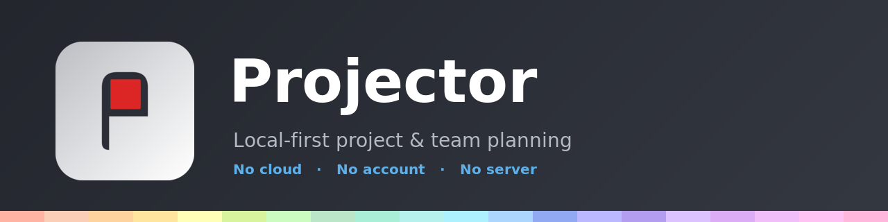

<p align="center">
  
</p>

<p align="center">
  <b>Run your team and hit your goals — entirely on your own machines.</b><br>
  A local-first project &amp; team planner built on plain Markdown + Mermaid gantt charts.
</p>

<p align="center">
  <i>No cloud. No account. No subscription. No server.</i>
</p>

---

## Why Projector

Most team-management and goal-setting tools want your data in their cloud and your
card on file. Projector doesn't. Every project is just a **`.md` file in a folder you
control** — readable, diff-able, and yours. Point Projector at a synced or shared
folder and a small team can **plan work, set goals, assign owners, and track status
together** while everything stays on disks you own.

Made for self-hosting and local-org folks who want to run a team without paying for a
cloud service.

## ⚡ Powerful local share

Need to show the team the plan in a meeting — without deploying anything or uploading
your data anywhere? **Share it over your own Wi-Fi in one click.**

- Projector spins up a tiny **read-only web viewer** on your machine. Anyone on the
  **same Wi-Fi network** opens a link in their browser and watches your board or
  timeline **update live** as you work.
- The share screen **names the Wi-Fi network** people need to join, so it's obvious who
  can connect.
- Guests **scan a QR code** to join and the meeting is gated by a **4-digit PIN**
  (with brute-force lockout), so only people in the room get in.
- Before anything is exposed, you get a **clear heads-up** that your computer will ask
  for permission to open the firewall — **only for this one shared view** — so the
  password/approval prompt is never a surprise.
- Works across **Linux, macOS, and Windows**, and the phone view is sized to read
  comfortably on a small screen.

Nothing leaves your LAN. Stop sharing and the link goes dead. Need a hand-out instead?
**Export any board or timeline to PDF** (one project or several).

## Views

- **Task List (Kanban)** — columns are *status* (To Do / In Progress / Done).
- **Timeline (Gantt)** — a Mermaid gantt rendered from the same file, with clickable bars.
- **Team** — one to-do lane per assignee, so everyone sees their own work.
- **Global** — every project across every workspace, colour-coded, in one view.

All four are different lenses on the **same Markdown files** — edit in the app or in your
own editor; it's just text.

## Workspaces & profiles

- A **workspace** is just an ordinary folder you open. Keep it in Syncthing / a NAS / a
  shared drive and the whole team works off the same files.
- **Profiles** split contexts (e.g. Work / Household), each with its own team roster.

## Stays current

Projector checks GitHub for new versions on launch (and once a day) and offers a
one-click jump to the download page — so you hear about updates without any telemetry
or account. Misplaced a task? The task editor can now **move it to another project**,
and each project takes a colour from a hand-tuned, hue-sorted pastel palette.

## Install

Download an installer from the [latest release](https://github.com/lhdharris/projector/releases/latest):

| Platform | File |
|---|---|
| Fedora / RHEL / openSUSE | `projector-app-<version>.x86_64.rpm` — `sudo rpm -i …` |
| Debian / Ubuntu | `projector-app_<version>_amd64.deb` — `sudo dpkg -i …` |
| macOS | `Projector-<version>.dmg` *(added per release — see below)* |
| Windows | `Projector Setup <version>.exe` *(added per release — see below)* |

> Builds are **unsigned**. macOS: right-click the app → **Open** (or
> `xattr -dr com.apple.quarantine /Applications/Projector.app`). Windows SmartScreen:
> **More info → Run anyway**.

## Run from source

```bash
cd electron-app
npm install
npm start
```

## Building installers

All targets are driven by `electron-builder`; run them from `electron-app/`. Each
installer must be built **on (or for) its own OS**:

```bash
# Linux (on Linux — needs rpmbuild for rpm, dpkg + fakeroot for deb)
npm run dist        # .rpm  (Fedora/RHEL/openSUSE)
npm run dist:deb    # .deb  (Debian/Ubuntu)

# macOS / Windows (on a Mac)
export CSC_IDENTITY_AUTO_DISCOVERY=false   # unsigned builds
npm run dist:mac    # .dmg  (host architecture)
npm run dist:win    # .exe  (NSIS; needs Wine on macOS)
npm run dist:all-on-mac   # dmg + exe + deb in one go
```

Output lands in `electron-app/dist/`. The Linux `.rpm`/`.deb` are built here; the
macOS `.dmg` and Windows `.exe` are built on a Mac and uploaded to the same release —
see **[`MAC_export.md`](MAC_export.md)** for the step-by-step Mac/Windows flow.

---

<p align="center"><sub>Local-first. Your team, your goals, your disks.</sub></p>
